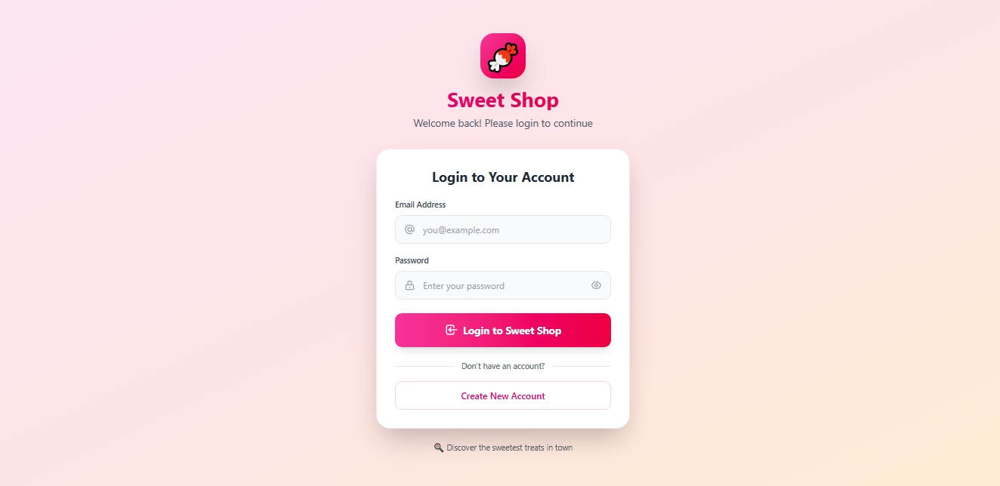
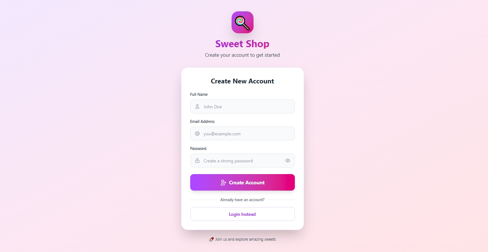
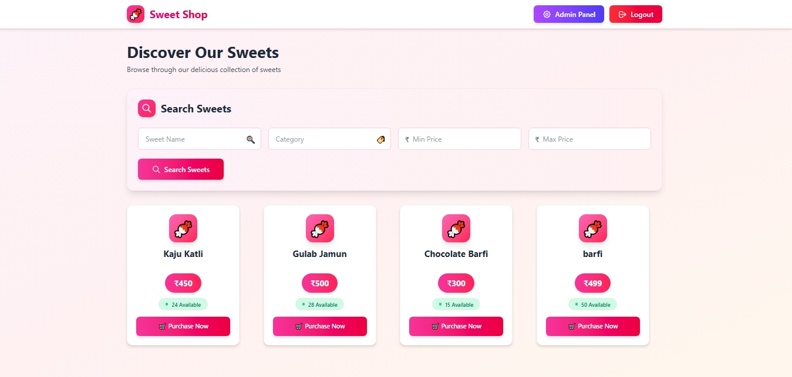
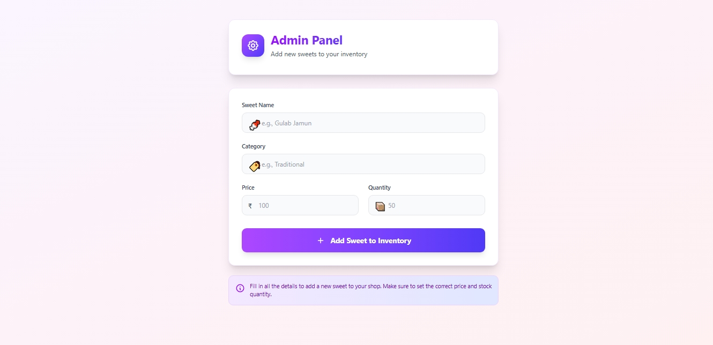

# 🍬 TDD Kata – Sweet Shop Management System

Author: Parthiv

A full‑stack Sweet Shop Management System built as part of the Incubyte TDD Kata assessment. The backend is developed using Test‑Driven Development (TDD), following clean architecture and REST principles.

Overview
- Register and login securely
- Browse, search and filter sweets
- Purchase sweets (inventory is updated)
- Admin users can add, update, restock, and delete sweets
- Backend developed with TDD (Jest & Supertest)

Tech Stack
- Frontend: React, Axios, React Router, CSS / UI components
- Backend: Node.js, Express, MongoDB, Mongoose, JWT
- Testing: Jest, Supertest

Project structure
- incubyte-assesment/
- │
- ├── sweet-shop-frontend/
- │   └── (React SPA)
- │
- ├── sweet-shop-backend/
- │   ├── src/
- │   │   ├── controllers/
- │   │   ├── models/
- │   │   ├── routes/
- │   │   ├── middleware/
- │   │   ├── app.js
- │   │   └── server.js
- │   │
- │   ├── tests/
- │   │   ├── auth/
- │   │   ├── sweets/
- │   │   └── inventory/
- │   │
- │   ├── .env.example
- │   ├── .gitignore
- │   └── package.json
- │
- └── README.md

Features

Authentication
- User registration & login
- JWT-based authentication
- Role-based access control (Admin / User)

Sweets Management
- Add new sweets (Admin)
- View all sweets
- Search & filter sweets by name, category, price range
- Update sweet details (Admin)
- Delete sweets (Admin)

Inventory Management
- Purchase sweets (decreases quantity)
- Restock sweets (Admin)
- Prevent purchase if stock is zero

Test-Driven Development (TDD)
- Tests are written before implementation following Red → Green → Refactor
- High test coverage targeted for:
  - Authentication flows
  - Sweets APIs
  - Inventory / purchase logic
- Tools: Jest, Supertest

Quickstart

1) Clone repository
```bash
git clone https://github.com/Parthiv-03/TDD-Kata-Sweet-Shop-Management-System.git
cd TDD-Kata-Sweet-Shop-Management-System
```

2) Backend setup
```bash
cd sweet-shop-backend
npm install
```

Create a `.env` (copy `.env.example` and fill values):

```
PORT=5000
MONGO_URI=your_mongodb_connection_string
JWT_SECRET=your_secret_key
```

Run backend (development):
```bash
npm run dev
```

3) Frontend setup
```bash
cd ../sweet-shop-frontend
npm install
npm start
```

Run backend tests
```bash
cd sweet-shop-backend
npm test
```

Notes on API
- The backend exposes REST endpoints for authentication, sweets management, and inventory operations.
- Typical endpoints (may vary by implementation):
  - POST /api/auth/register
  - POST /api/auth/login
  - GET /api/sweets
  - POST /api/sweets (admin)
  - PUT /api/sweets/:id (admin)
  - DELETE /api/sweets/:id (admin)
  - POST /api/purchase (decrease stock)
  - POST /api/sweets/:id/restock (admin)
- Consult the backend routes folder for exact routes and request/response shapes.

Screenshots
- Screenshots of the UI and sample API responses are located in the repository root. Refer to them for visual reference.

- LoginPage

  

- RegisterPage

  

- DashBoard

  

- AdminPage

  


AI Usage
- Tools used: ChatGPT (OpenAI)
- How AI was used:
  - Designing REST API structure
  - Generating initial test cases for TDD
  - Debugging Jest and MongoDB issues
  - Improving code readability and architecture
  - Writing documentation and commit messages
- Reflection: AI helped accelerate boilerplate, maintain TDD flow, and focus on logic/design. All AI-assisted code was reviewed and modified by the author.

Contributing
- Contributions, bug reports, and pull requests are welcome. Please follow the TDD approach when adding features: write tests first, implement, then refactor.

License
- (Add your preferred license here)

Contact
- Author: Parthiv
- Repository: https://github.com/Parthiv-03/TDD-Kata-Sweet-Shop-Management-System

Thank you for checking out the TDD Kata – Sweet Shop Management System! Happy testing and sweet coding 🍭
